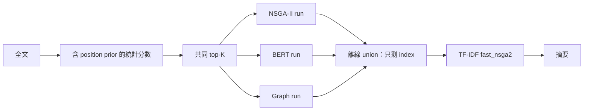
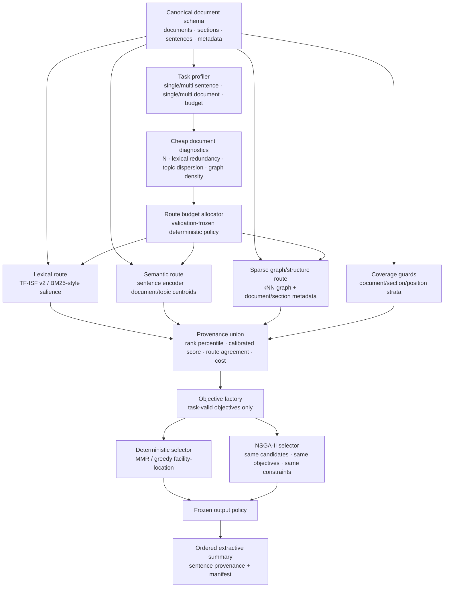

# 最終候選架構規格 —— Provenance-Aware Adaptive Extractive Summarization

> 狀態：**Target Architecture v1，尚未 freeze**  
> freeze 條件：完成資料重建、validation pilot、selector isolation 與 route utility gate。  
> 研究標準與 Go/No-Go 仍以 `paper_revision_plan_IEEE_Access.md` 為準；本文件是技術架構的單一規格來源。

## 0. 結論

現有「三個完整 run → 離線 union → 再跑 NSGA-II」不能保留為新系統。需要保留的是研究問題，不是 legacy 接線。

最終候選架構只保留四個核心概念：

1. **完整輸入上的多路候選生成**：lexical、semantic、graph/structure 各自排名，不能先被共同 top-K 截斷。
2. **provenance-aware candidate fusion**：保留每句來自哪一路、rank、校準分數與成本，不再只傳 index。
3. **task-profiled objective factory**：依單句／多句、單文件／多文件決定有效 objective；不再把同一套 redundancy 強套所有資料集。
4. **optimizer isolation**：同一 objective 與候選池下比較 deterministic selector 與 NSGA-II；NSGA-II 沒有獨立效益就退出核心架構與標題。

這不是承諾「三路一定互補」；每一路都有明確刪除條件。

---

## 0.1 ⚠️ 刪除條件同時觸發的後果（必須先定價）

§5.3、§5.4、§7.3 各自的刪除條件單獨看都正確，但**沒有一處說明它們同時成立會發生什麼**。
把最壞情境走完：

| 觸發 | 條件 | 後果 |
|---|---|---|
| §5.3 | semantic route 無 unique recall／無 quality gain | 刪除 PLM 軌 |
| §5.4 | graph route 與 semantic 高度重複且無增量 | 刪除 graph 軌 |
| §7.3 | NSGA-II 相對 deterministic selector 無獨立效益 | meta-heuristic 退出核心與標題 |

**三者同時成立 → 最終系統是「lexical route + MMR + provenance union」。**

這已經不是《Meta-Heuristic Optimization, Graph Centrality, and PLM Semantics》那篇論文，
**ICACT 得獎的核心角度會從標題完全消失。**

這不是設計缺陷 —— 由 legacy 診斷（系統行為接近昂貴版 Lead）來看，這個風險是真實的。
但它必須**在 Phase −1 就定價，不能等 Phase 3 才浮現**。

### 必須先回答的問題

- [ ] 若只剩 lexical + MMR + provenance，**還投不投**？投什麼題目？
- [ ] 若 meta-heuristic 退出，ICACT extension 的關聯要怎麼寫？
      （IEEE Access 要求引用並說明與 conference 版的關係；若核心方法已不同，
      這可能不再是 extension 而是新論文 —— 兩者的 cover letter 寫法不同）
- [ ] provenance-aware adaptive selection 這個定位，**單獨是否足以構成 IEEE Access 的方法貢獻**？

> 建議：三個問題在動工前寫下答案，並記入 Phase −1 的決策紀錄。

---

## 0.2 ⚠️ 執行規模與時間（本規格描述的是新研究專案，不是論文修訂）

用 legacy 的實際耗時推算（Multi-News 5,622 篇，單 seed）：

| 項目 | 實測／推算 |
|---|---|
| 含 NSGA-II 的單次 run | 平均 **5.0 小時**（10 個 legacy run 的實測平均） |
| §9 最小 ablation 矩陣：8 ablation × 2 primary × 5 seeds | **80 runs** |
| 若維持目前速度 | **≈ 399 小時 = 17 天連續計算** |
| 即使新架構快 5 倍 | 仍需 **≈ 3.3 天連續計算** |

**這還不包含**：5 個 baseline、§10 的 6 個 pilot、sensitivity 掃描、
以及 GovReport（文件長度約為 Multi-News 的數倍，greedy reference 成本顯著更高）。

加上新增 GovReport、重建 Multi-News document boundaries、實作 §11 的 12 個新模組：

> **單人執行的合理估計：4–6 個月**（原「論文修訂」估計為 8–12 週）。

### 建議：先定義最小可投稿版本（MVP），把風險切小

不要一開始就展開完整規格。建議第一關只做：

| 範圍 | MVP 做 | MVP 不做 |
|---|---|---|
| 資料集 | Primary A **擇一** | 第二個 primary、sensitivity 版本 |
| Route | lexical + semantic | graph route |
| Routing | 固定 quota | adaptive router |
| Selector | deterministic vs NSGA-II isolation | Pareto policy 掃描 |
| 目標 | **驗證能不能贏 Lead 與 PacSum** | 完整 ablation 矩陣 |

**MVP 贏不了 → 提前止血，改走 empirical study／negative result。**
**MVP 贏得了 → 再依本規格擴張。**

這樣把 4–6 個月的風險切成 **6–8 週的第一關**。
MVP 的通過條件沿用 §10 Freeze gate 的第一條，但只要求單一 primary dataset。

---

## 1. 資料集決策

### 1.1 建議配置

| 角色 | 資料集 | 決策 | 原因與限制 |
|---|---|---|---|
| Primary A | **GovReport** | 保留，先做 validation pilot | 長單文件、長摘要，最適合檢驗全局 coverage、scaling 與 adaptive routing；官方約 19.5k 筆，常用 split 為 17,517/973/973，CC BY 4.0。本機尚未下載，正式採用前須驗證原始檔、split、checksum 與 section 可用性。 |
| Primary B | **Multi-News** | 保留；validation 已重建，其他 split 待補 | 官方 split 44,972/5,622/5,622，適合 cross-document coverage 與去重。pinned validation 已重建為 5,621 筆 structurally valid canonical rows，保存 document boundaries，並凍結 main／clean sensitivity policy；train/test 仍待生成，legacy 扁平資料不得用於正式結果。 |
| Data-quality sensitivity | **Multi-News bad-retrieval-removed / Multi-News+** | 不取代主 benchmark，作 paired sensitivity | 原版有錯誤 retrieval 與無關文件；官方 Multi-News repo 已提供 bad-retrieval-removed 版本，Multi-News+ 另用 LLM 清理。必須保存 mapping、版本與移除規則，不能把兩者混成一個新 split。 |
| Sanity | CNN/DailyMail | Appendix／sanity | 官方 test 11,490；lead bias 強、文件較短，不是核心方法的理想主場，但可檢查方法是否退化。 |
| Protocol stress | SciTLDR-AIC | 僅在 official conformance 通過後保留 | 官方單句抽取使 redundancy 與 subset search 幾乎失效；使用 files2rouge 與 max-R1-reference。不能用它證明多目標選句有效。 |
| Reserve | PubMed | GovReport 不可用或 pilot 失敗時再評估 | 長科學文件可作替代，但不要一開始同時擴張三個主資料集。 |

### 1.2 不可再共用的「假統一」

- `max_words`：人類可解釋的輸出長度限制。
- `max_sentences`：SciTLDR 等官方句數限制。
- `max_model_tokens`：encoder 單句／batch 截斷限制。
- `candidate_budget`：進入 subset selector 的候選數。
- `compute_budget`：是否啟用 semantic route、graph route 與 NSGA-II。

五者必須是不同欄位；不得再用 `max_tokens` 同時代表多種語義。正式輸出 budget 只能用 validation 或官方協定決定，不能從 test reference 長度反推。

## 2. Legacy 架構為什麼必須淘汰



已確認的架構問題：

- semantic route 沒有在完整輸入排名。
- position prior 在候選生成前就排除中後段句子。
- union 丟失 raw score、rank、route agreement 與原始 document identity。
- Stage 2 的 `w_bert` 實際加權 TF-IDF。
- NSGA-II importance 使用總和，與 coverage 一起把解推向長度邊界。
- legacy processed Multi-News 遺失 document boundaries，無法真正計算 cross-document coverage；canonical validation 已修復此資料契約，但舊 artifact 的限制不會因此消失。
- candidate、feature 與 graph 路徑仍有吞掉例外後回傳空值／fallback 的情況。
- 單句與多句任務共用三目標 formulation，objective semantics 不成立。

## 3. Target Architecture v1



## 4. Canonical schemas

### 4.1 DocumentExample

```text
DocumentExample
  id: str
  split: train | validation | test
  documents[]:
    document_id: str
    source_order: int
    sections[]:
      section_id: str | null
      heading: str | null
      sentences[]:
        sentence_id: str
        text: str
        document_position: float
        section_position: float | null
  references[]: str
  task_profile:
    input_mode: single_document | multi_document
    output_mode: single_sentence | multi_sentence
  data_fingerprint: str
```

原始 document/section boundaries 不存在時必須明確記為 unavailable，不能以扁平 index 假裝跨文件結構。

### 4.2 CandidateRecord

```text
CandidateRecord
  sentence_id
  original_index
  document_id
  section_id
  word_count
  route_scores:
    lexical: {raw, rank, percentile} | null
    semantic: {raw, rank, percentile, model_id} | null
    graph: {raw, rank, percentile, graph_id} | null
  selected_by_routes[]
  route_agreement
  fused_importance
  estimated_route_cost
```

所有缺失 route 必須記為 `null` 並附原因；不得用 0.0 假裝「有效但分數為零」。

## 5. 各模組的最終責任

### 5.1 Data and task profiler

- 統一分句，但保存原始 document/section/timestamp metadata。
- 驗證 row count、ID uniqueness、空文件、reference 數、字元異常與 checksum。
- 只由輸入 schema 和預先凍結 config 產生 task profile，不讀 test reference。
- 單句模式直接關閉 redundancy、multi-document coverage 與 subset NSGA-II。

### 5.2 Lexical route：永遠啟用的低成本 anchor

- 使用 length-normalized TF-ISF v2 或經 validation 選定的 BM25-style salience。
- position 只能作獨立、可消融的弱 prior，不能再混入唯一候選入口。
- 輸出完整排名或至少足以重建 rank 的分數，不輸出 length-bounded summary。

### 5.3 Semantic route：昂貴但可選

- 使用 sentence-similarity checkpoint，不使用 raw BERT/RoBERTa 名稱當作方法貢獻。
- 一次載入、batch encode、明確 `max_model_tokens`，記錄被截斷比例。
- 分數至少包含 global centroid relevance；長文件可加入 topic-centroid max/mean，但每項都需 ablation。
- semantic route 若沒有 unique validated candidate recall 或 quality gain，整路刪除。

### 5.4 Sparse graph/structure route

- 禁止建立無界 dense `N×N` graph 作長文件預設；使用 sparse top-k neighbors 或可證明可承受的 block graph。
- graph edge type 必須可列舉：lexical similarity、semantic similarity、same-document、same-section；未實作 entity/coreference 就不得寫。
- PageRank／centrality 只是一種 route score，不等於 coherence。
- graph route 若與 semantic route 高度重複且沒有增量效果，刪除 graph route，而不是為了「三軌」硬留。

### 5.5 Adaptive route budget allocator

輸入只能是 inference-time 可得的廉價特徵：

- 句數、文件數、section 數。
- lexical redundancy／topic dispersion。
- cheap lexical graph density。
- 預估 semantic 與 graph 成本。

輸出：每一路 `enabled` 與 candidate quota。第一版採 deterministic rules，threshold 只在 validation 凍結；不先做 learned router，避免再引入訓練與資料量問題。

### 5.6 Provenance-aware fusion

- 不直接平均不可比的 raw scores。
- 第一版以 rank percentile、reciprocal-rank fusion、route agreement 與明確 strata guard 組合；normalized fusion 必須實際送入 selector，不可只收藏 provenance 後仍用 lexical score。
- 每一路先獨立 top-K，再作 union；相同 sentence 合併 provenance，不複製候選。
- position/document/section strata 是 coverage guard，不是假裝第四個獨立語意模型。
- `route_top_k` 是 proposal depth，`min_per_route` 是 route evidence reservation，`total` 是最終 pool cap；三者不得混稱 quota。
- route-exclusive reservations 與 coverage guards 先進池，剩餘空位才用 RRF；RRF 僅能在 proposal union 加 guards 內選，不可從全文任意補句。union 小於 cap 時允許 underfill 並記錄原因。

## 6. Objective factory

### 6.1 多句任務的共同定義

對候選集合 `S`，只保留三類可解釋訊號：

1. **Salience**：selected candidates 的 calibrated importance；採 mean 或 length-normalized aggregation，具體版本由 validation pilot 決定。
2. **Source coverage**：對全文句子／topic 的 facility-location coverage；多文件時可加入預先定義的 document-group component。
3. **Redundancy**：selected sentences 的平均 pairwise similarity。

硬限制：

- `effective_min_words <= selected_words <= max_words`。`requested_min_words` 是全域實驗設定；`effective_min_words = min(requested_min_words, source_capacity_words)`，其中 capacity 必須精確考慮句子不可切割、`max_words` 與 `max_sentences`。只有完整來源本身不可達時可逐列調降並記錄 reason；若全文可達但 hard candidate pool 不可達，屬 pipeline defect，禁止再次調降。若不設 min_words，必須另報實際長度並做 length-matched baseline。
- `max_sentences` 僅在資料集協定要求時啟用。
- 空集合不可成為合法最終摘要。
- 單句長度已超過 active word/token budget 時，該句在 extractive contract 下永遠不可選，必須在 route top-K 前移出 selection universe，且於 artifact 保存 sentence ID、word count 與 reason；不得讓它消耗 route reservation 或 total candidate cap。這不授權靜默重切 canonical sentence。

所有 objective 在單一文件內正規化到固定方向與尺度；不能把未正規化 sum、mean 與成本混在一起。

Phase 1e 已實作此工程契約：coverage 明確使用 `full source sentences × candidates` 矩陣，redundancy 使用 `candidates × candidates` 矩陣；不得以 candidate-only coverage 冒充 source coverage。prediction 的 `coverage_universe_size` 必須等於完整來源句數，供 artifact audit。此處只代表 correctness 已接線，不代表 objective 權重或方法效果已在 validation 證實。

### 6.2 Task-specific 啟用矩陣

| Task profile | Salience | Facility coverage | Redundancy | Group coverage | Selector |
|---|---:|---:|---:|---:|---|
| Single sentence | ✅ | 可併入 ranking | 關閉 | 關閉 | deterministic rank only |
| Multi-sentence single document | ✅ | ✅ | ✅ | section/topic 可選 | deterministic + NSGA-II isolation |
| Multi-sentence multi-document | ✅ | ✅ | ✅ | document/topic component | deterministic + NSGA-II isolation |

不得按 dataset 名稱偷換公式；差異只能由 task profile 與可用 metadata 觸發。

## 7. Selector 與 Pareto output policy

### 7.1 Deterministic selector

- 必須有 MMR 或 greedy facility-location 版本。
- 與 NSGA-II 使用完全相同候選、相似度、objective 與長度限制。
- 它既是 baseline，也是判斷 metaheuristic 是否必要的對照組。

### 7.2 NSGA-II selector

- 回傳完整 Pareto front 與 per-solution objectives，不得只回傳一個不可追溯 index set。
- population、generation、seed 與 operator 全部寫入 effective config。
- final solution 以 validation 凍結的 knee/reference-point rule 選取，不可 test 後挑最好 scalar weights。
- failure 直接報錯，不得 fallback 到 greedy。

目前 Phase 1e 實作已由 shared evaluator 產生三目標與四類 feasibility constraint，並把完整可行 Pareto front、每解 objective、最後選中 row 寫入 prediction artifact。現行 `weighted_sum_on_shared_objectives` 只作工程驗證的 provisional policy；未在 validation 凍結 knee／reference-point policy 前，不得當成最終論文設定。

### 7.3 Metaheuristic 生存 gate

NSGA-II 只有同時滿足下列至少一項，才保留在論文核心：

- 在 matched candidate/objective/budget 下，相對 deterministic selector 有 paired quality gain。
- 在相同品質下提供可量化的 coverage/redundancy Pareto 優勢。
- 在不同輸出 budget 上提供穩定、可解釋且 deterministic 方法無法達到的 operating points。

若全部不成立：改投「provenance-aware adaptive extractive selection」架構，NSGA-II 降為負結果／附錄，論文標題移除 meta-heuristic。

## 8. Output policy 與可重現性

- selected sentences 以凍結的 deterministic ordering 輸出；預設保留 source document order 與 sentence order。
- 每句保存 sentence_id、route provenance、final objectives 與選取理由。
- 保存 data fingerprint、commit、config hash、model revision、hardware、seed、runtime 分解與 peak memory。
- evaluator 依資料集分開：多句資料使用驗證後的 Lsum protocol；SciTLDR 使用官方 files2rouge。
- 所有 route/selector failure 都是 failed run，不產生看似正常的 predictions。

## 9. 必跑消融矩陣

| 問題 | 對照 |
|---|---|
| 候選池是否真的改善？ | common prefilter vs independent full-input routes |
| provenance 是否有用？ | index-only union vs rank-only vs full provenance |
| semantic 是否有增量？ | lexical only vs +semantic |
| graph 是否有增量？ | lexical+semantic vs +graph |
| adaptive routing 是否值得？ | all-routes-always vs deterministic router |
| NSGA-II 是否必要？ | greedy/MMR/facility-location vs NSGA-II，同候選同 objective |
| objective 是否有基數偏誤？ | sum vs mean/length-normalized + length distribution |
| 資料噪音是否改變結論？ | original Multi-News vs bad-retrieval-removed/Multi-News+ paired subset |

每個 ablation 必須同時報 quality、實際輸出長度、candidate recall、route unique contribution、runtime 與 memory。

## 10. 架構 freeze 前的 pilot

只用 validation；不得查看新 test 結果。

1. **Data pilot**：重建 GovReport validation 與 Multi-News validation，保存 boundaries、manifest 與 checksum。
2. **Reality pilot**：Lead、LexRank/TextRank、PacSum、SBERT centroid、MMR/facility-location。
3. **Candidate pilot**：lexical／semantic／graph 各自的 recall@K、unique recall、位置與文件覆蓋。
4. **Selector pilot**：固定候選後比較 deterministic 與 NSGA-II。
5. **Cost pilot**：cold load、warm inference、route cost、selector cost、peak memory。
6. **Freeze decision**：刪除無增量 route，固定 objective、router、candidate budget 與 Pareto policy。

### Freeze gate

- 兩個 primary validation 都至少不劣於同 regime 的強 baseline；其中一個有實質 quality 或 quality-cost 優勢。
- semantic／graph 每一路若保留，都有非零 unique contribution 與相符 ablation。
- NSGA-II 通過 §7.3；否則退出核心。
- 所有 schema、budget 與 evaluator conformance tests 通過。
- test 尚未被新 pipeline 執行。

## 11. 預定程式邊界

```text
src/
  data/
    schemas.py
    preprocess_govreport.py
    preprocess_multinews.py
    validate_dataset.py
  routing/
    task_profiler.py
    budget_allocator.py
  candidates/
    lexical.py
    semantic.py
    graph.py
    provenance_union.py
  objectives/
    factory.py
    salience.py
    coverage.py
    redundancy.py
  selectors/
    deterministic.py
    nsga2.py
    pareto_policy.py
  pipeline/
    summarize.py
    manifest.py
  eval/
    rouge.py
    scitldr_official.py
    statistics.py
```

先以新 namespace 實作，不在 legacy `fast_fused.py` 上持續堆疊條件分支；legacy 僅保留重現用途。

## 12. 目前不能先寫進論文的主張

- 三路互補。
- graph 改善 coherence。
- adaptive routing 提升效率而不損品質。
- NSGA-II 優於 deterministic selection。
- 不受長輸入限制。
- 跨領域有效。
- 以較低成本達到相同品質。

這些都是待驗證假設，不是架構圖本身能證明的貢獻。

## 13. 已核對來源

- GovReport paper: https://aclanthology.org/2021.naacl-main.112/
- GovReport official site/license: https://gov-report-data.github.io/
- GovReport official code: https://github.com/luyang-huang96/LongDocSum
- Multi-News official repo: https://github.com/Alex-Fabbri/Multi-News
- Multi-News splits: https://www.tensorflow.org/datasets/catalog/multi_news
- Multi-News+ paper: https://aclanthology.org/2024.emnlp-main.2/
- Multi-News+ official repo: https://github.com/c-juhwan/multi_news_plus
- SciTLDR official repo/evaluator: https://github.com/allenai/scitldr
